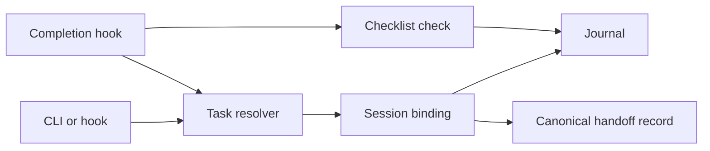

# Architecture and recovery

The CLI adapts commands to local modules. The task lifecycle has no server or model call.

| State | Authority |
|---|---|
| Selected task/workspace/journal | Explicit session binding |
| Prepared/accepted handoff and generation | Canonical handoff JSON |
| Agreed scope and evidence references | Task journal |
| Actual behavior | Inspected test/runtime/provider evidence |
| Repository default | Discovery candidate |
| Permissions and credentials | Host/OS/provider controls |

`task-store.mjs` owns state paths, identity parsing, locks and atomic JSON replacement. Task IDs allow letters, digits, underscores and hyphens, up to 128 characters. Binding requires a regular journal with a matching unfenced Task-ID.

## Handoff commit point

1. Prepare a uniquely identified handoff record.
2. Receiver locks the handoff and session records and checks task, workspace, recipient and replacement intent.
3. Write the receiver binding with handoff ID and generation.
4. Commit the canonical handoff as accepted by that receiver/generation.

Step 4 acknowledges acceptance. A process interrupted after step 3 leaves a pending binding. Retrying the same acceptance completes it. Another receiver cannot accept the committed record. Journal notes are derived; CURRENT is never mutated by handoff.

The journal and execution worktree identify the transferred task. The sender's chat workspace is informational; a receiver may have a different chat workspace, which its binding preserves separately.

Atomic replacement prevents partially serialized JSON for cooperating processes. It does not guarantee durability against power loss, a hostile same-user process or an unreliable network filesystem.

## Locks and paths

Mutation paths reject symlink roots/files where documented. Parent aliases such as macOS `/tmp` may resolve normally. Keep state in trusted private directories.

A crash can leave a lock. Inspect its PID/time and pending records, confirm the owner is no longer running, remove only that stale lock, then retry the same operation. Never delete the entire state directory as recovery.

## Completion and setup

Checks report `ready`, `incomplete` or `invalid`, with `evidenceVerified: false`. Known invalid state blocks an explicit completion marker once. Unknown hook input may degrade rather than block shutdown; integrations must not treat that as verified readiness.

Setup owns only `.agent-process-kit/INSTRUCTIONS.md`, `hooks.example.json` and its receipt. It previews by default and writes the receipt before payload files. Rollback validates allowlisted paths and hashes, allowing partial setup recovery while preserving edited/foreign files.

The v0.1 CLI is public. Internal exports and storage schemas can evolve; read release notes before upgrading. Native hook registration belongs to the host and needs separate verification.
